

  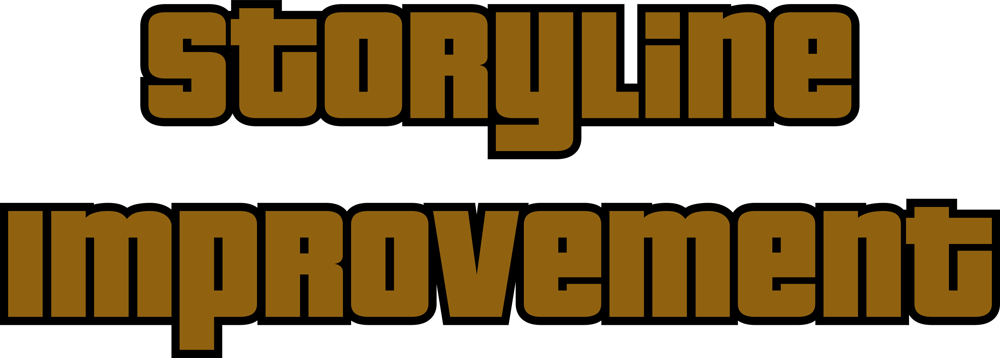

---

  

  <code>PROJECT</code> <b>STORYLINE IMPROVEMENT</b>

  
  
  

---

## 📖 About the Mod

**Storyline Improvement (SIM)** is a comprehensive enhancement for **Grand Theft Auto: San Andreas**, designed as a carefully balanced hybrid between *Story Mode 2.0* and *Things To Do in San Andreas*.

The mod expands the game's narrative by restoring additional cut dialogue and character interactions, resulting in a more complete, immersive, and cohesive storytelling experience—while fully preserving the gameplay features introduced by *Story Mode 2.0*.

---

## 🎯 Core Focus

* 🚫 **No New Missions:** SIM does not add custom missions. Instead, its focus is entirely on refining and expanding the existing storyline.
* 📦 **Restored Content:** Reintroduces special characters, cut dialogue, and narrative elements originally removed or left unfinished during development.
* ♻️ **Authentic Continuity:** Every change is meticulously crafted to feel natural within the original structure of the game, maintaining absolute immersion.

---

## 💡 Origin & Distinction

It can be considered a fixed and refined alternative to *Storyline Enhancement* by Laremi Story. SIM is ideal for players who want deeper context, stronger character presence, and a more polished narrative without altering the core mechanics or spirit of GTA San Andreas.

> **Important Note:** SIM WAS NOT built on SEM's base. This was done entirely from scratch to avoid inheriting bugs, technical flaws, and legacy issues inherent in SEM.

---

## 🎥 Showcase & Walkthrough

Check out the full walkthrough and demonstration of the mod in action:

  

  <b>NOTE:</b> The full walkthrough video features an older build of <b>Storyline Improvement</b>. Some things may appear different.

---

## 📸 Screenshots

  <em>Note: Other mods were used in the screenshots alongside <b>Storyline Improvement</b>.</em>

<table>
  <tr>
    <td align="center" width="33%">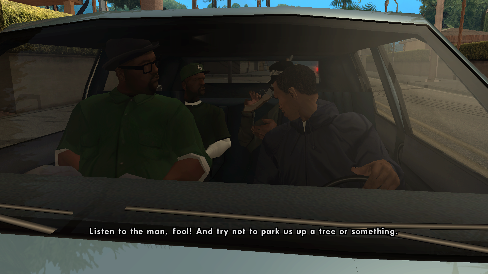</td>
    <td align="center" width="33%">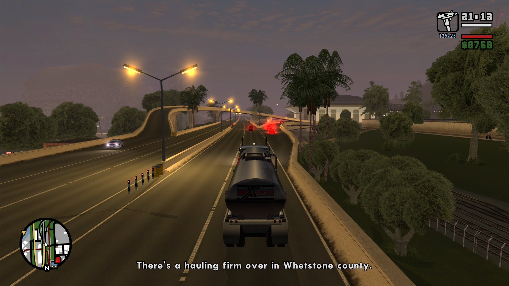</td>
    <td align="center" width="33%">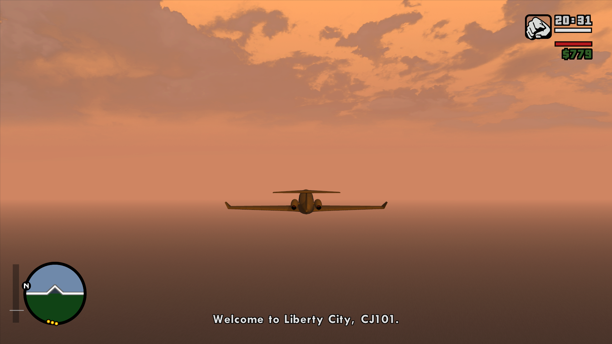</td>
  </tr>
  <tr>
    <td align="center" width="33%">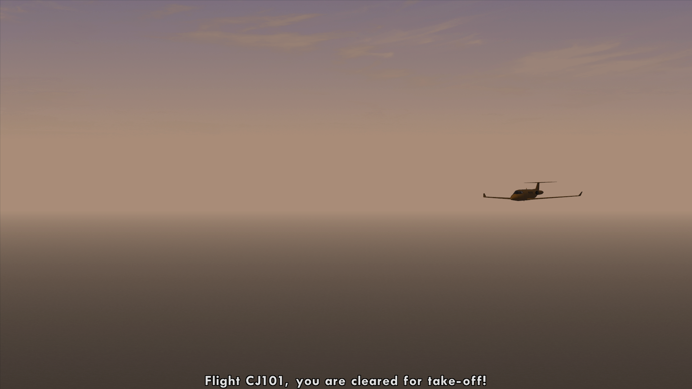</td>
    <td align="center" width="33%">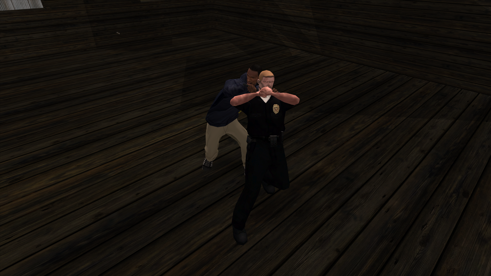</td>
    <td align="center" width="33%">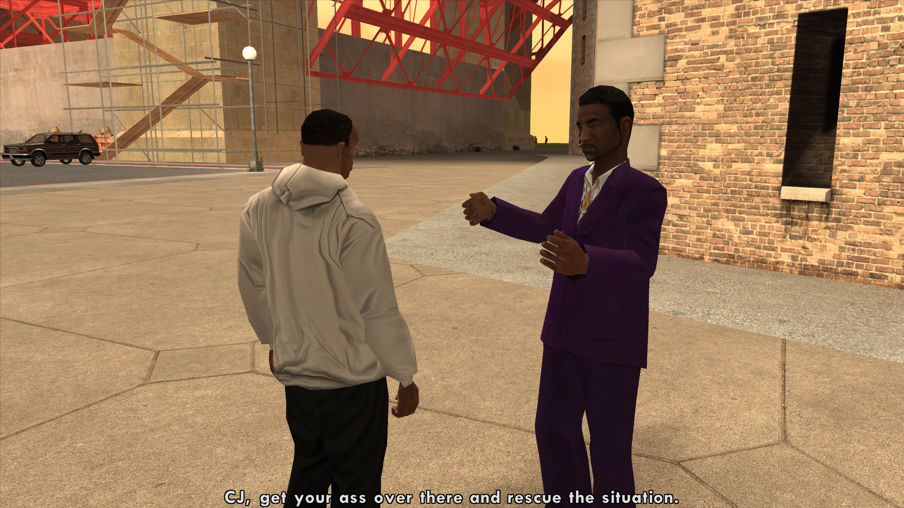</td>
  </tr>
  <tr>
    <td align="center" width="33%">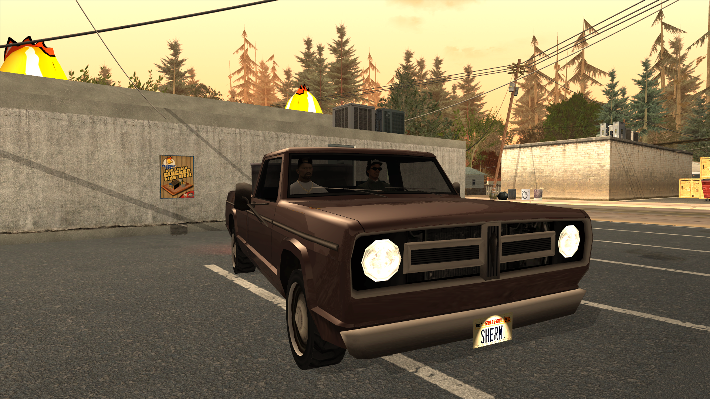</td>
    <td align="center" width="33%">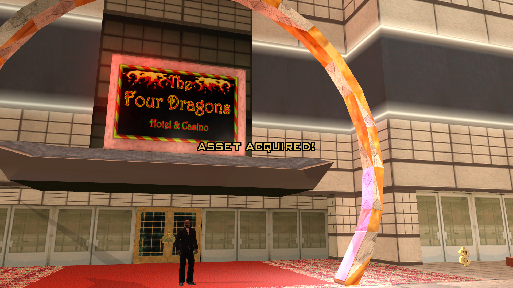</td>
    <td align="center" width="33%">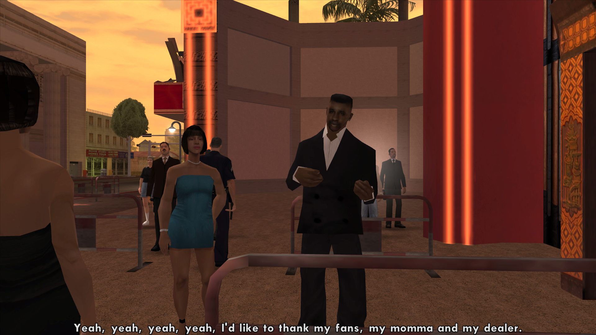</td>
  </tr>
  <tr>
    <td align="center" width="33%">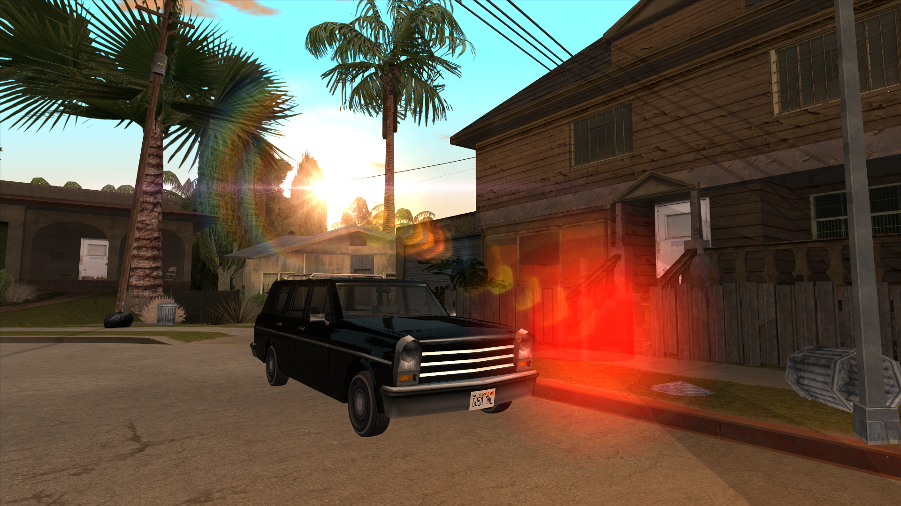</td>
    <td align="center" width="33%">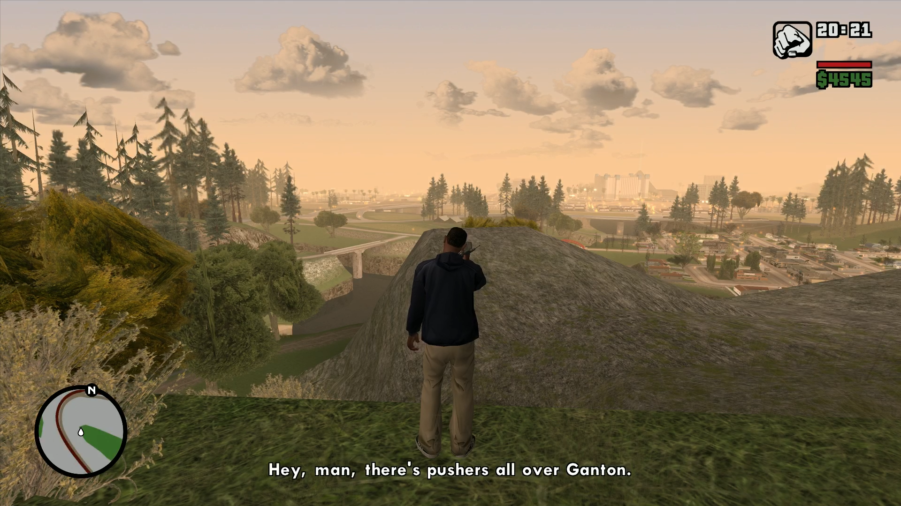</td>
    <td align="center" width="33%">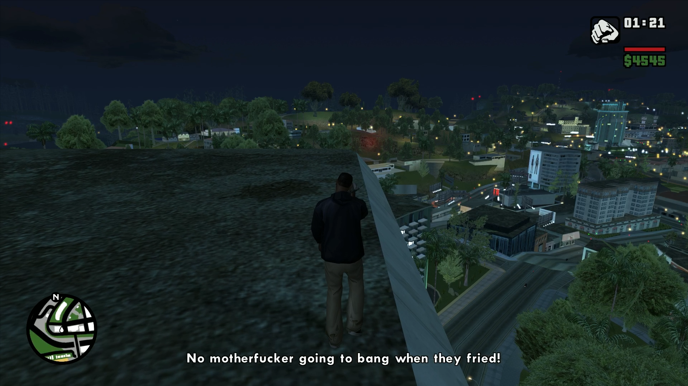</td>
  </tr>
  <tr>
    <td align="center" width="33%">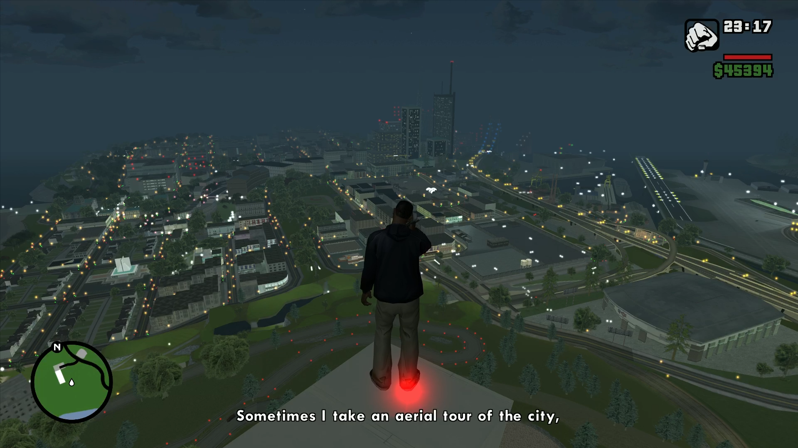</td>
    <td align="center" width="33%">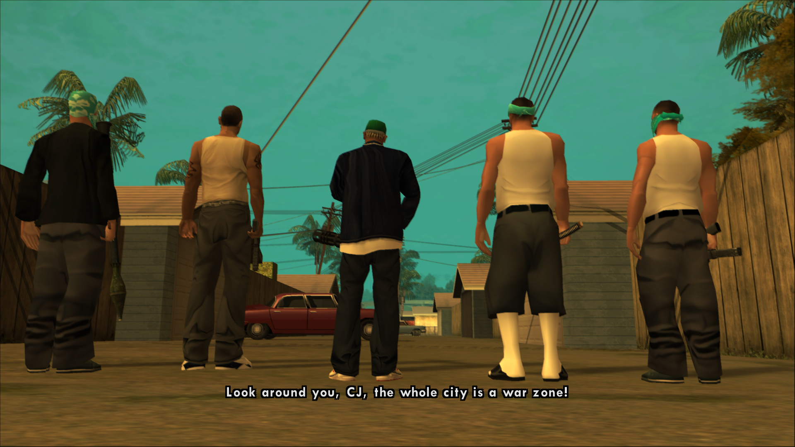</td>
    <td align="center" width="33%">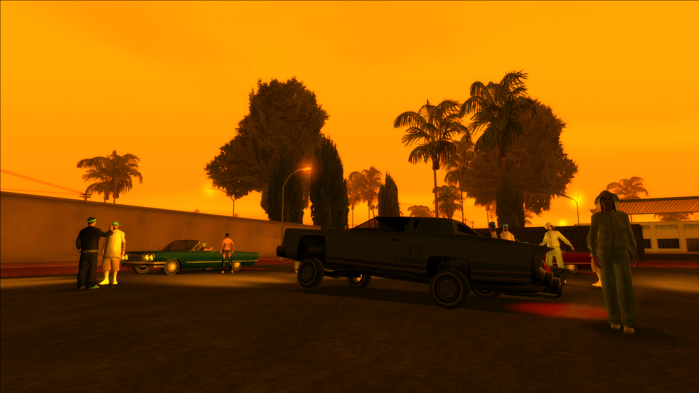</td>
  </tr>
</table>

---

## 📥 Download & Community

Get the mod, check out updates, and join the community through the links below:

* 🌐 **GitHub Releases (Direct Archive):** [GitHub Releases Page](https://github.com/rixgeo/storyline-improvement/releases)
* 📥 **Liberty City Download:** [Download SIM on Liberty City](https://libertycity.net/files/gta-san-andreas/232696-storyline-improvement.html)
* 👤 **Liberty City Profile:** [rixgeo on Liberty City](https://libertycity.net/user/rixgeo/)
* 📺 **YouTube Channel:** [rixgeo on YouTube](https://www.youtube.com/@rixgeo)
* 💬 **Discord Community:** [Join the Discord Server](https://discord.gg/duzJypUqXK)

   *Detailed installation instructions can be found inside the download archive.*

  <b>NOTE:</b> Storyline Improvement is also available on GTAinside & NexusMods, but they never have and never will receive updates. The reason to this is that these sites are difficult to work with.

---

  Copyright © 2026 rixgeo. All rights reserved.

